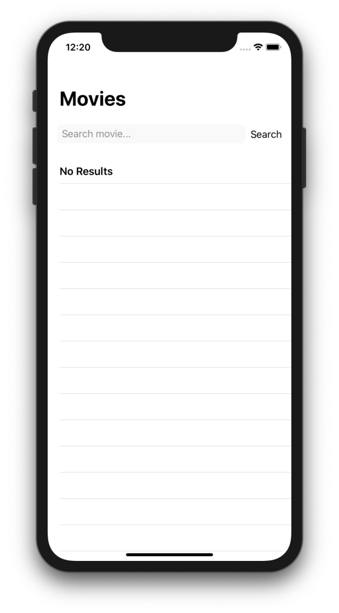
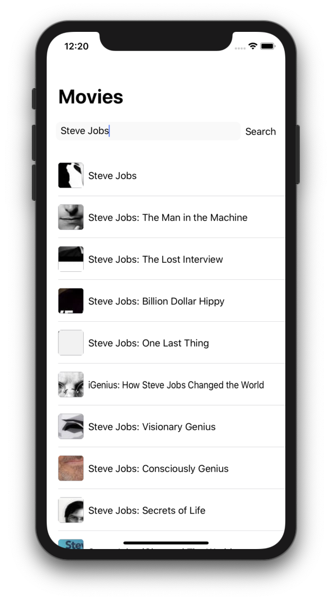
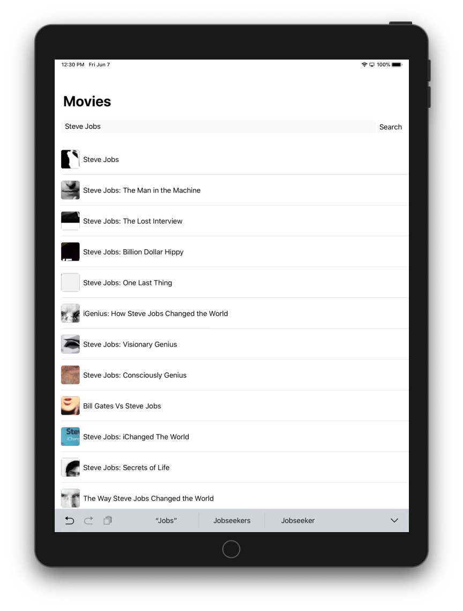

  

# SwiftUI + Combine - 🎬

Movie app to explore <a href="https://developer.apple.com/xcode/swiftui/">SwiftUI</a> + <a href="https://developer.apple.com/documentation/combine/">Combine</a> using MVVM.
 
## 📸 Screenshots

  

## 📚 Credit

<a href="https://github.com/ra1028">ra1028</a>

<a href="https://github.com/RuiAAPeres">RuiAAPeres</a> 